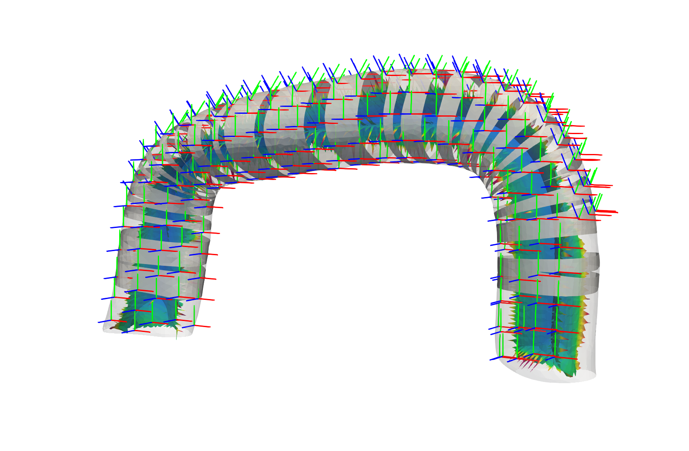

## TUBULAR TOOLPATH CREATOR



## Installation
```shell

# Create a new ROS workspace
mkdir -p ~/catkin_ws/src && cd ~/catkin_ws/src

# Download demo repository
git clone https://github.com/bi3ri/tubular_toolpath_creator.git

# Install dependencies
pip3 install vtk numpy pyvista open3d

# Build workspace
cd ~/catkin_ws && catkin build 

# Source workspace
source ~/catkin_ws/devel/setup.bash

```


## Dependencies
The centerline algorithm relies on vmtk, which needs to run with python 3.5. We decided to use conda to create a compatible enviornment.

```shell
# Conda environment
create -n vmtk -c vmtk python=3.5 itk vtk vmtk 
```


## Run
The Tubular-toolpath-creator can be used by starting the launch file with a defined mesh path. If the mesh_path is left empth a node with a service is started. 

```shell
# Start the toolpath_creator_node
roslaunch tubular_toolpath_creator debug:=True mesh_path:=<mesh_path>
# Info: Debug is by default false. If mesh_path is left empty, a node is started.
# Parameters: There are many parameters to adapt. See the launch file to get an overview.
```


## Service 
```shell

#request
string mesh_path
---
#response
std_msgs/Float64MultiArray raster_degrees
geometry_msgs/PoseArray[] raster_array
```
